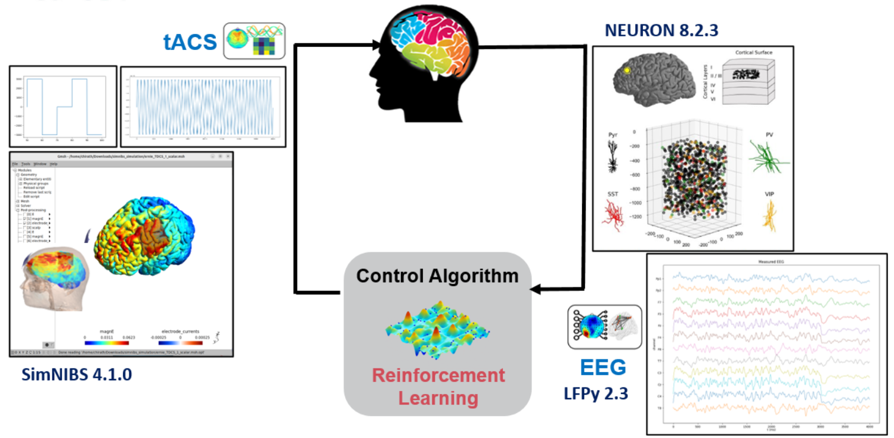

<p align="center">

</p>

---
<h1>NeuroStimEnv: A Reinforcement Learning Environment for Closed-Loop Transcranial Brain
Stimulation of Biological Neural Circuits</h1>


[](https://www.python.org/downloads/release/python-31012/)

**NeuroStimEnv** is a project to develop Reinforcement Learning (RL)-based transcranial stimulation treatment targeting different psychiatric and neurological disorders. The framework allows integration of different neural circuits using the NEURON simulation engine and develop RL algorithms to modulate the target neural oscillations (brain waves).

<div align="center">

</div>

Using the project
--

<h4>Installation</h4>

* Create and activate a Python3.10.12 virtual environment. <br>
* Clone the repository: <code>git clone git@github.com:chirathyh/neurostimenv.git</code>.<br>
* Go to the project folder (neurostimenv): <code>cd neurostimenv</code>. <br> 
* Install the required Python libraries <code>requirements.txt</code>. <br>
* Create an environment file <code>.env</code> at the root of the project folder with <code>MAIN_PATH=path-to-this-project</code> (<code>echo "MAIN_PATH=$(pwd)">.env</code>).<br>
* Compile and load NMODL (.mod) files, which define custom biophysical mechanisms like ion channels, synapses, and other membrane properties. Run command <code>nrnivmodl /path/to/modfiles</code> for the target neural circuit (e.g., <code>nrnivmodl /setup/circuits/L23Net/mod</code>).
---

<h4>Prerequsites</h4>

* The environment (i.e., biological neural circuit) is based on the gym framework. <br>
* The neural environment is simulated using <code>NEURON==8.2.3</code> and <code>LFPy==2.3</code>. <br>
* You can download different neural circuit models from ModelDB (https://modeldb.science/). <br>
* The project uses the <code>SimNIBS==4.1.0</code> for obtaining parameters for the transcranial stimulation. <br>

<h4>Quick Start - Running RL algorithms</h4>

Running a stochastic multi-arm bandit algorithm for a simple Ball and Stick Model.
```
cd experiments/bandit 
mpirun -np 2 python run_mbandit.py experiment.name=test env=ballnstick agent=mbandit env.network.syn_activity=True experiment.tqdm=False agent.pretrain=True agent.checkpoint=test6
```

Running a Implicit Q-Learning algorithm for a depression mirocircuit (HL23Net: https://pubmed.ncbi.nlm.nih.gov/35021088/).
```
cd experiments/drl 
mpirun -np 512 python run_iql.py experiment.name=test env=hl23net env.network.syn_activity=True experiment.debug=True experiment.tqdm=False experiment.plot=False
```

<h4>Quick Start - Running SimNIBS to obtain stimulation parameters</h4>

First we simulate the effects of the selected stimulation parameters and electrode montage setup. Next, we use the simulation output and evaluates its effects on the target microcircuit by calculating the current at the region of interest. Finally, the calculated current will be applied in the NEURON simulation.   
```
cd env/ts/simnibs 
simnibs_python run_simnibs_tacs.py
simnibs_python calc_roi_field.py
```
Optionally, you can use the full capability of SimNIBS to optimise the applied stimulation to a target brain region.
```
cd env/ts/simnibs 
simnibs_python optimise_tdcs.py
```

<h4>Handling experiment parameters</h4>
The experiment parameters are handled using <code>hydra</code> and <code>yaml</code> files. There are settings for both RL-agents as well as the neural circuits (environment).
Example settings for an environment (<code>hl23net</code>) (summarised).

```yaml
name: 'hl23net'  # name of the microcircuit (environment)

simulation:  # simulation settings
  duration: 55000  # ms
  obs_win_len: 500 #ms
  MDD: True  # healthy OR MDD
  DRUG: False  # add drugs
  
network:  # microcircuit settings
  dt: 0.0625 # ms (full resolution - 0.025  )
  tstart: 0.
  v_init: -80.
  celsius: 34.
  verbose: False

  position: [0., 0., 78200]  # µm, also used as single dipole reference for EEG/ECoG: 78200; -725

  syn_activity: True
  synapse:
    start: 0.
    interval: 10.
    number: 1000
    noise: 1.0

eeg:  # measurement (sensor)
  measure: True
  locations: [[0., 0., 90000.]]  # µm
  foursphereheadmodel:
    radii: [79000., 80000., 85000., 90000.]  # µm ["Brain", "CSF", "Skull", "Scalp"]
    sigmas: [0.3, 1.5, 0.015, 0.3]  # conductivity: (S/m)

ts:  # actuator
  apply: True
  method: 'tdcs'  # 'tacs, tdcs, tms
  type: 'pulse' #'tdcs'  # tdcs, pulse, sin
  # run simnibs to generate extracellular current density
  calc: False
  simnibs_params:
    output: ''
    positions: ['AF3', 'FC5']
    currents: # n actions, Amperes
      - [1, -1]   # mA, sum to 0
      - [2, -2]
      - [4, -4]
      - [15, -15]
    shapes: ['ellipse', 'ellipse']  # Set the shape, default to 'rect'
    dimensions: [25, 25]  # Set the dimensions, default to 50x50 mm
    thicknesses: [1.5, 1.5]  # Set the thickness, default to 4 mm

    roi_coordinate:
      location: [-37.1796,  68.4849,  34.9607]
      type: 'world' #'mni', 'world'
      radius: 10 # mm

  # extracellular position in network: RecExtElectrode
  electrodeParameters: # get the location < x, y, z in µm > from the network position: network.position
    r: 20.  # µm; radius of each contact surface
    n: 50  # number of discrete points used to compute the n-point average potential on each circular contact point
    sigma: 0.3  # extracellular conductivity in units of (S/m)
    method: "pointsource"   
```

Example settings for an RL agent (<code>mbandit</code>).
```yaml
agent: 'mbandit'  # name of the RL algorithm
debug: False
pretrain: False
checkpoint: 'sample-checkpoint-to-restart'
n_arms: 6
n_trials: 3
n_eval_trials: 2
```

<h4>Important Notes</h4>

* Running large neural circuits require a high-performance computing environment (e.g., <code>env=hl23net env.network.dt=0.025</code> with N=1,000 neurons and at dt=0.025). <br>
* To test the framework on your local machine, use the <code>env=ballnstick</code>, which uses a simple circuit (N=40) without any biophesical mechanisms. <br>
* Setting up neural circuit models
  - mod files: These are the mechanisms (e.g., Ca+2, K+ channels).
  - compile the files: <code>nrnivmodl</code>
  - model files
  - morphology files

Currently integrated microcircuits (Environments)
--
| Environment          | Notes                                                                                                                     | Compute Resources               |
|----------------------|---------------------------------------------------------------------------------------------------------------------------|---------------------------------|
| <code>ballnstick</code> | Simple ball-and-stick neuron model, simplified morphology and biophysics. A toy example to help understand the framework. | Local machine (very minimal)    |
| <code>hl23pyrnet</code> | Human cortical L2/3 pyramidal cells, a small adjustable population. Inspired by examples available on LFPy.               | Local machine (moderate)        |
| <code>hl23net</code> | Depression and healthy microcircuit by Yao et al. A detailed model refer the manuscript and other resources.              | High performance compute (high) |


### Citing
```
@misc{neurostimenv,
     author={NeuroStimEnv Team},
     title={NeuroStimEnv (2025)},
     year = {2025},
     publisher = {GitHub},
     journal = {GitHub repository},
     howpublished = {\url{https://github.com/chirathyh/neurostimenv}},
   }
```

Reporting Issues, Feature Requests & Contributing to the project
--
Please contact Chirath Hettiarachchi (chirath.hettiarachchi@anu.edu.au) for reporting issues or contributing to the project. Your thoughts & comments are welcome, which will be valuable towards the research in this domain.

Acknowledgement
--
This research was funded by the MRFF 2022 National Critical Research Infrastructure (Project No. MRFCRI000138, titled “Developing a new digital therapeutic or
depression: Closed loop non-invasive brain stimulation”). This work was supported
by computational resources provided by the Australian Government through the
National Computational Infrastructure (NCI) under the National Computational
Merit Allocation Scheme (Project No. va80) and ANU Merit Allocation Scheme
(Project No. ny83).

We also acknowledge the open-source scientific contributors related to NEURON, SimNIBS, LFPy, and HL23NET microcircuit projects.

Contact
--
Chirath Hettiarachchi - chirath.hettiarachchi@anu.edu.au\
School of Computing, Australian National University. 


